<div align="center">

# Geekatplay ComfyUI Asset Vault

**A local-first control room for your ComfyUI installation.**
Every model, LoRA, custom node, workflow and generated output — indexed, explained, searchable, and kept tidy.

Built and maintained by **[Geekatplay Studio](https://www.geekatplay.com) — Vladimir Chopine**

[](#requirements)
[](#tech-stack)
[](#tech-stack)
[](#model-context-protocol-server)
[](docs/CHANGELOG.md)

</div>

---

It runs entirely on your machine. Nothing is uploaded anywhere. Nothing is changed on disk unless
you explicitly ask for it — and even then, deletions go to a recoverable trash by default.

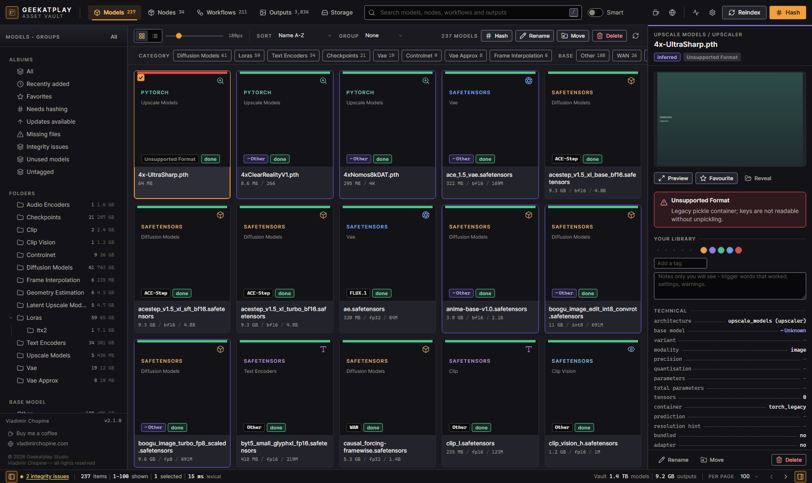

## Table of contents

- [Why this exists](#why-this-exists)
- [Feature tour](#feature-tour)
  - [Models, LoRAs, VAEs, ControlNets](#models-loras-vaes-controlnets)
  - [Custom & official nodes](#custom--official-nodes)
  - [Workflows, and fixing them](#workflows-and-fixing-them)
  - [Generated outputs](#generated-outputs)
  - [Search](#search)
  - [Storage & maintenance](#storage--maintenance)
  - [ComfyUI version & updates](#comfyui-version--updates)
  - [Model Context Protocol server](#model-context-protocol-server)
- [What this app never does](#what-this-app-never-does)
- [Quick start](#quick-start)
- [Requirements](#requirements)
- [Tech stack](#tech-stack)
- [Project structure](#project-structure)
- [Scale it was built and measured against](#scale-it-was-built-and-measured-against)
- [Ports, paths and files](#ports-paths-and-files)
- [Running without the launcher](#running-without-the-launcher)
- [Testing](#testing)
- [Security](#security)
- [Documentation](#documentation)
- [Roadmap / known limits](#roadmap--known-limits)
- [Contributing](#contributing)
- [License](#license)

---

## Why this exists

A serious ComfyUI setup sprawls fast: hundreds of gigabytes of checkpoints and LoRAs across a dozen
folders, dozens of custom node packages of wildly varying quality, hundreds of workflows collected
from everywhere, and thousands of generated outputs. ComfyUI itself has no inventory of any of it —
you find out a model is missing when a queue fails, and you find out a drive is full when Windows
tells you.

The Asset Vault is that missing inventory layer: a fast local index of everything installed, with
enough real understanding of each file to tell you what it *is*, not just its filename — and enough
understanding of your workflows to tell you what each one *needs* before you hit Queue.

It was built, tested and tuned against a genuinely large real-world installation — **237 models
totalling 1.59 TB, 34 custom node packages, 211 workflows and 3,834 generated outputs** — not a
handful of sample files. The numbers throughout this README are measured against that install, not
estimated.

---

## Feature tour

### Models, LoRAs, VAEs, ControlNets

Reads `.safetensors` headers, GGUF headers and legacy torch containers **without loading tensors
into RAM** — a multi-gigabyte checkpoint is inspected in milliseconds. For each file it reports:

- **Architecture family** — SD1.5, SD2.x, SDXL, SD3, FLUX.1, FLUX.2, Pony, Illustrious, NoobAI,
  Lumina, HiDream, Qwen-Image, WAN, HunyuanVideo, LTX-Video, Mochi, CogVideo, ACE-Step,
  StableAudio, Hunyuan3D, Cascade, AuraFlow, Kolors, PixArt, and more — detected from tensor key
  signatures and `__metadata__`, never guessed from the filename.
- **Role** — checkpoint, UNet/diffusion model, LoRA, VAE, text encoder, ControlNet, upscaler,
  embedding, IP-Adapter, and others.
- **Precision, quantisation and parameter count**, including a **component breakdown** for a
  bundled checkpoint that contains a UNet, text encoder *and* VAE in one file.
- **An integrity verdict** — `ok`, `truncated`, `not_a_model`, `unsupported_format` — so a corrupt
  or mislabelled file is flagged instead of silently mis-parsed.
- **Which workflows use it**, with links straight to them.
- **Civitai enrichment** once a file is hashed — description, trigger words, recommended sampler
  settings, and whether a newer version exists — never blocking the initial scan.

Every fact on a model card says where it came from. **Amber means measured from your files. Violet
means inferred, and is marked with a `~`.** A guess is never dressed up as a fact.

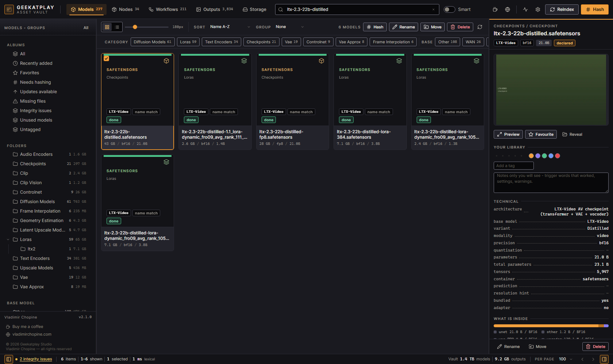

### Custom & official nodes

Scans `custom_nodes/` and records every package: git remote, branch and commit, declared Python
dependencies, author, and every node class it registers — class name, category, inputs and
outputs.

Node classes are discovered by **statically parsing the Python source with Python's own `ast`
module.** Package code is never imported and never executed — a hostile `__init__.py` in a node
pack you installed six months ago and forgot about cannot run inside the vault. Six independent
extraction strategies are layered so real-world packages that build their registration dict via
imports, `.update()` calls or module aggregation are still fully recovered, not just the trivial
`NODE_CLASS_MAPPINGS = {...}` case.

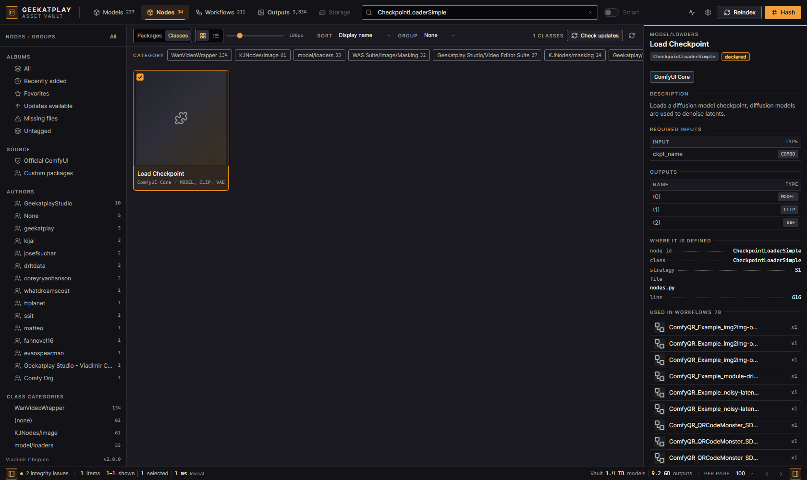

### Workflows, and fixing them

Indexes `.json` graphs and workflows embedded in `.png` / `.webp` outputs — from
`user/default/workflows`, the root `workflows/` folder, and `custom_nodes/*/workflows` and
`*/example_workflows`. Each one is labelled by origin: **your own**, an **official ComfyUI
template**, or **bundled with a node package**.

For every workflow, the vault resolves each referenced model and node class against what is
actually installed and reports precisely what's missing — with near-match suggestions when a file
was renamed or moved, and an install hint (resolved from the ComfyUI-Manager registry) for a
missing node package.

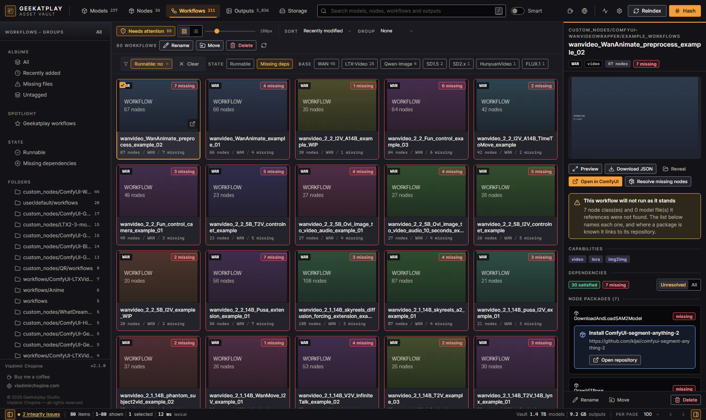

**Enable** turns that report into an action, deliberately structured so nothing happens without
you seeing it first:

1. You see the **full plan** — every missing item, the folder it would go into, its download size,
   and the free space on the destination drive.
2. You **tick what you want fetched.** Nothing downloads by default.
3. Models are sourced only from **Civitai or Hugging Face**; node packages only from
   **registry-declared repositories** — never an arbitrary URL, and redirects are re-validated
   against the same allow-list on every hop.
4. Every download is **verified against a checksum and quarantined on mismatch**, never placed
   silently.
5. Node packages are **cloned but never installed** — no `pip install`, no `requirements.txt`, no
   `install.py` runs on your behalf. You get the exact command to run yourself.
6. Space is checked **before** anything starts, so a workflow that needs more than you have free
   fails loudly, up front — not halfway through a 40 GB download.

### Generated outputs

Indexes images, video, audio, 3D models and text from `output/`, extracts the embedded
generation graph, and pulls out prompt, negative prompt, seed, sampler, steps, CFG and the
checkpoint used — resolving ComfyUI's node-link references so a prompt that lives three nodes
away from the sampler is still attributed correctly. Thumbnails are generated into a local cache
so the grid stays smooth over thousands of files. Click through to a full-resolution **lightbox**
with the complete metadata beside it.

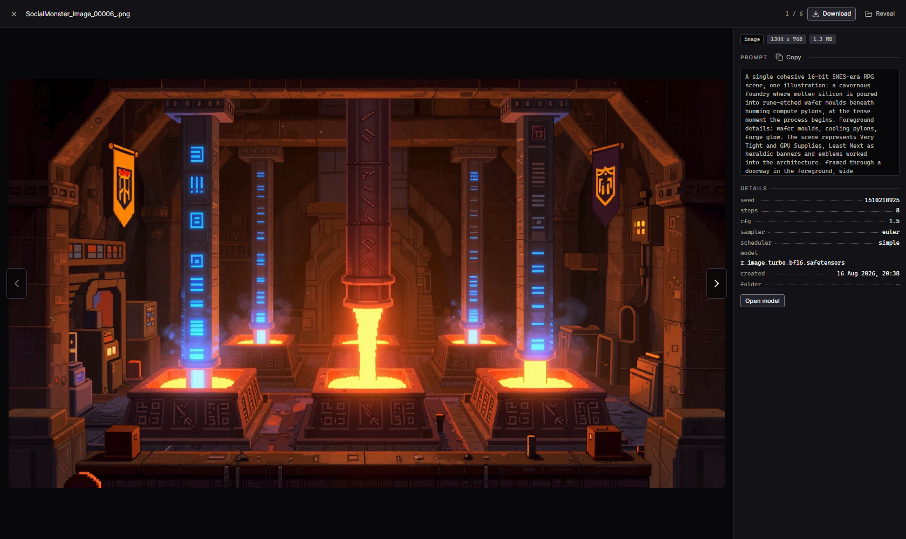

**Video and audio play in place.** A play button sits on every playable asset — grid tile, list
row and the details panel — and turns into a real player where it stands. The poster stays until
you ask for playback, so a grid of several thousand outputs never holds thousands of media
elements, only the one you are watching. **Only one thing plays at a time**: starting a second
clip pauses the first, anywhere in the app. Pause is pause; a separate stop button rewinds and
hands the poster back.

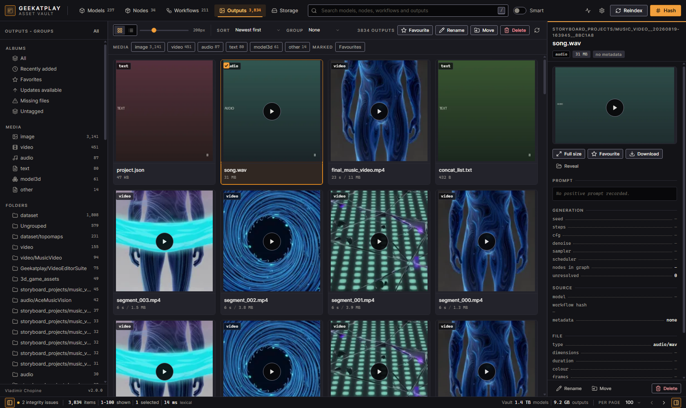

**Video posters** are extracted with ffmpeg when you have it installed, seeking a second in so
the thumbnail is not the opening black frame. Without ffmpeg videos fall back to a placeholder
and say so — the feature degrades, it does not error.

**3D models** (`.glb`, `.gltf`, `.fbx`) get an interactive preview — orbit, zoom, auto-rotate —
in the details panel and the lightbox, framed automatically from the model's bounding box. The
browser also hands one rendered frame back to the vault, so the grid gets a real poster for the
model rather than a coloured placeholder. There is no server-side 3D renderer: the picture comes
out of work the browser had already done to show you the model.

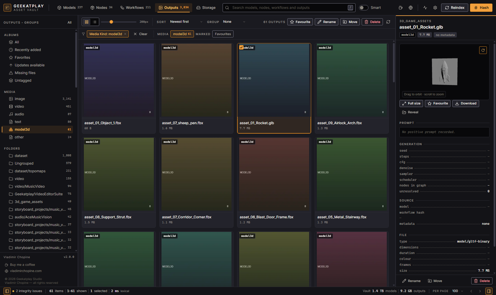

**Text and JSON** are shown as formatted text, with JSON pretty-printed. Whether a file counts as
text is decided from its **bytes, not its extension** — a ComfyUI output folder holds `.pt`
tensor files that are PyTorch pickles, sometimes hundreds of megabytes, and those are reported as
binary instead of being rendered as a screen of mojibake.

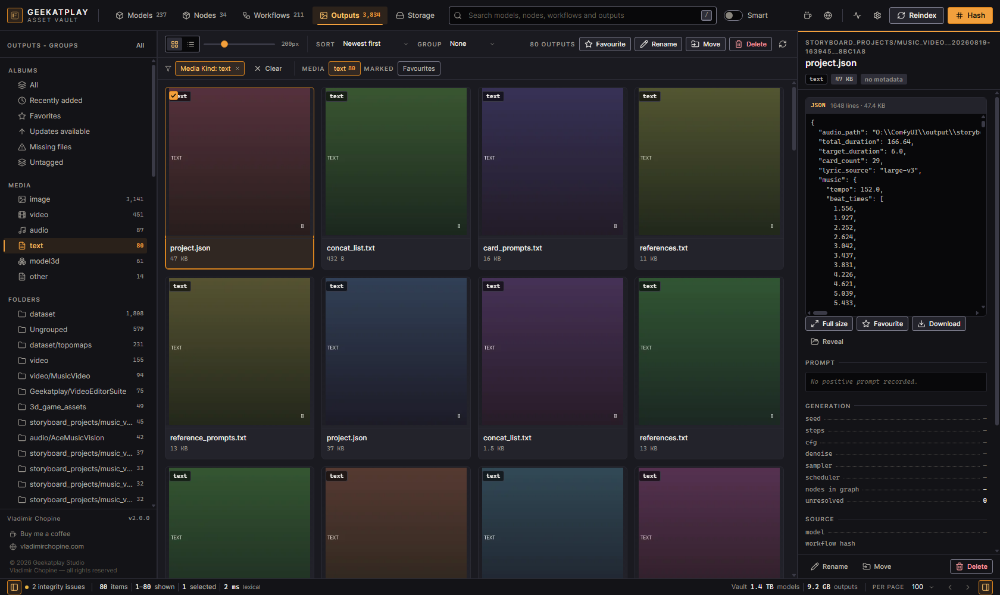

### Search

Lexical full-text search (SQLite FTS5) across every indexed asset is **always available** and
typically answers in single-digit milliseconds. A **Smart** toggle adds semantic ranking once you
enable the optional local embedding model (~23 MB, downloaded once, fully offline afterwards —
CPU-only ONNX, no `torch` dependency). Until it's enabled the toggle reads as unavailable and says
why; search still works, it's simply lexical.

### Storage & maintenance

A dedicated tab that answers the question every large install eventually asks: **where did my
terabyte go, and what can I safely delete?**

- Footprint broken down by models / outputs / inputs / custom nodes / cache, and **free space per
  drive** for every root you've configured — useful the moment your library spans more than one
  disk.
- A ranked list of cleanup candidates, sortable by **reclaim score, raw size, or age**, covering
  models with no workflow and no output referencing them, files untouched for months, likely
  duplicates, and files that fail an integrity check.
- Every reason is labelled **measured or inferred** — and the UI is explicit when an entire
  category reads as "100% unused," since that usually means the indexer can't see a reference
  path yet, not that every file in it is disposable.
- **Trash-backed by default.** Reclaiming space never means an irreversible click.

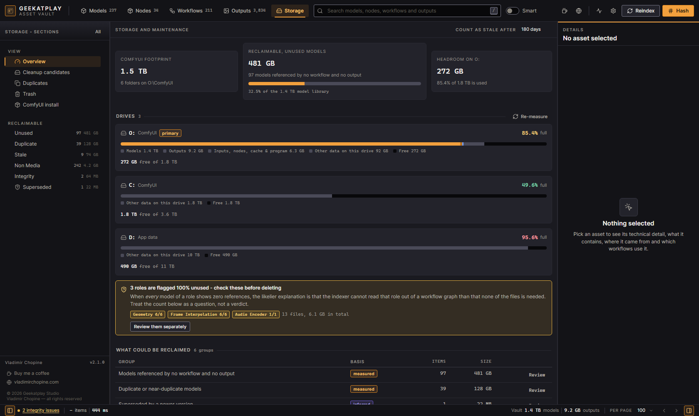

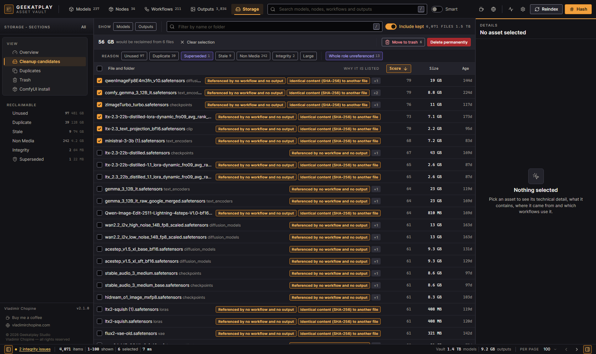

### ComfyUI version & updates

Detects your installed ComfyUI version and install flavour (portable / git checkout), and checks —
read-only, and gracefully offline — whether a newer one is available. Running ComfyUI's own
updater requires you to explicitly confirm the **exact absolute path** that will execute, streams
its output live, and is refused outright while ComfyUI appears to be running.

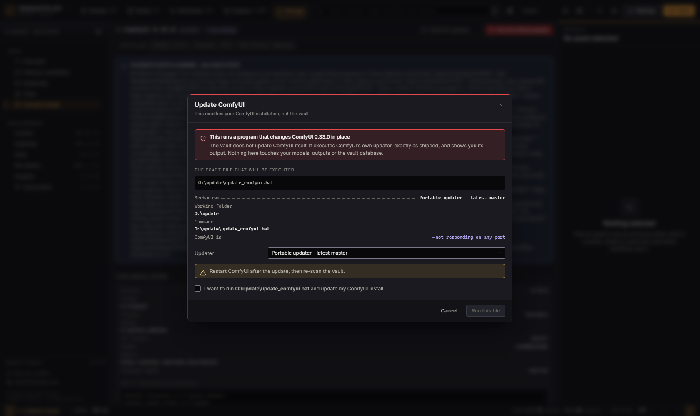

### Model Context Protocol server

A conformant **MCP server** — over both Streamable HTTP and stdio — exposing **26 tools** so an
MCP-capable AI client can search, inspect and (if you choose to allow it) manage the library
conversationally: list and filter models, inspect a workflow's dependencies, search semantically,
rename, move, delete, restore from trash, enqueue hashing, and more.

Full file-operation access, including delete, is available by design — deliberately, after
weighing the risk of an AI agent with write access to an irreplaceable model library. It comes with
real rails, not a policy document: **trash-backed by default**, permanent deletion requires an
explicit `confirm: true`, every mutating call is capped at 200 items per batch, **every mutation is
written to a queryable audit log** (readable from Settings → Activity in the UI, shown below), and
the whole surface can be flipped to strictly read-only with one config flag.

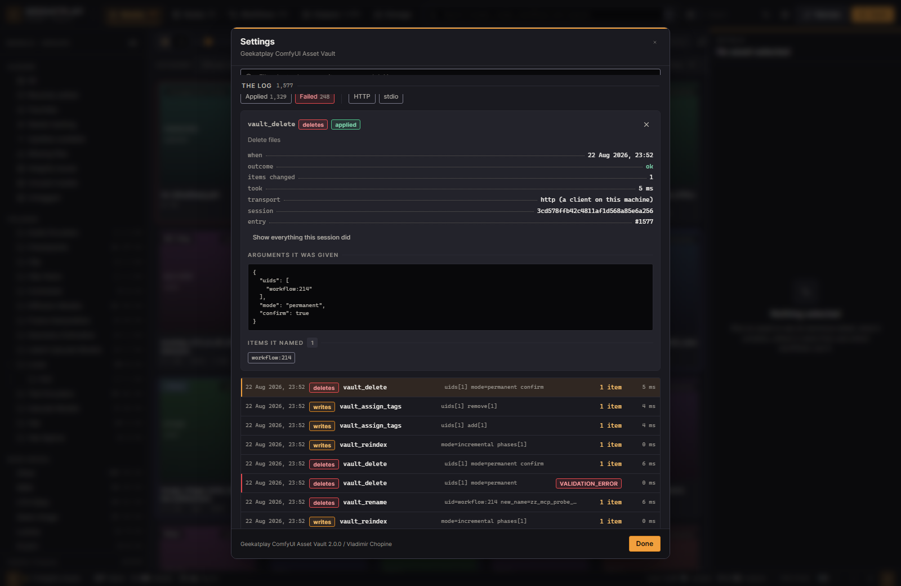

See **[docs/MCP_CLIENT_SETUP.md](docs/MCP_CLIENT_SETUP.md)** for client configuration and the full
tool reference.

---

## What this app never does

These are hard product rules, not preferences.

| It never… | Why it matters |
|---|---|
| **Modifies a model file without an explicit action from you.** | Scanning is strictly read-only. Rename, move and delete happen only when you click them — or when an MCP client calls a mutating tool, which is audited. |
| **Uploads anything, anywhere.** | Your files, prompts and outputs never leave the machine. Civitai and Ollama lookups are optional, off by default, and send only a hash or a short text snippet — never a file. |
| **Downloads anything you didn't tick.** | The only thing it fetches is what you selected from a plan shown to you first, from Civitai, Hugging Face, or a registry-declared repository — nowhere else. Every download is verified and quarantined on mismatch. |
| **Imports or executes custom node code.** | Node classes are extracted by statically parsing the source with Python's AST. A malicious `__init__.py` cannot run inside the vault. Node package installers and `requirements.txt` are never run for you — the app tells you the command and you decide. |
| **Auto-updates ComfyUI.** | The version check is read-only and degrades to "unknown" offline. Running ComfyUI's own updater requires your explicit confirmation, names the exact absolute path that will execute, and is refused while ComfyUI appears to be running. |
| **Deletes without confirmation.** | Every delete goes through a confirmation dialog. **Trash is the default** — files move to a recoverable folder inside the root they came from. Permanent deletion is a separate, explicit choice. |

Two more, for completeness: file operations are refused outside the roots you've configured, and no
API or MCP tool accepts a raw filesystem path as input — every asset is addressed by an internal,
opaque `uid`.

---

## Quick start

```bat
install_dependencies.bat
start_app.bat
```

`install_dependencies.bat` creates a Python virtual environment, installs the backend and frontend
dependencies, and verifies both before it finishes.

`start_app.bat` starts the vault engine on **http://127.0.0.1:8127**, waits until it actually
accepts connections (not just until the process launches), then starts the interface on
**http://localhost:3000** and opens it in your browser. `stop_app.bat` shuts the engine down
cleanly.

On first launch a short wizard asks where ComfyUI is installed, validates the folder live as you
type, and runs the first scan.

Full instructions → **[docs/INSTALL.md](docs/INSTALL.md)**
Day-to-day use → **[docs/USER_GUIDE.md](docs/USER_GUIDE.md)**
Something looks wrong → **[docs/TROUBLESHOOTING.md](docs/TROUBLESHOOTING.md)**

---

## Requirements

| | |
|---|---|
| OS | Windows 10 / 11 (paths, long-path handling and file locking are all written for Win32) |
| Python | 3.10 or newer |
| Node.js | 18 or newer |
| ComfyUI | Any recent install — portable or `git`-checkout. The vault indexes it; it doesn't need ComfyUI running. |
| Disk | The vault database and thumbnail cache are typically well under 100 MB even for a large library |

---

## Tech stack

**Backend** — Python, [FastAPI](https://fastapi.tiangolo.com/) + [uvicorn](https://www.uvicorn.org/),
SQLite (WAL mode, FTS5 full-text search, a small vector store for semantic search), [Pillow](https://python-pillow.org/)
for image/thumbnail handling, [onnxruntime](https://onnxruntime.ai/) for fully local, CPU-only
embeddings — deliberately **no PyTorch dependency** in the backend. No ORM: hand-written SQL behind
a typed query layer, because the query patterns are known and fixed.

**Frontend** — [React 18](https://react.dev/) + [Vite](https://vitejs.dev/), [lucide-react](https://lucide.dev/)
for icons. No state-management library, no CSS framework, no component library — a hand-rolled
design system (tokens, virtualised grid, own modal/toast/tree primitives) tuned specifically for
browsing tens of thousands of dense asset cards smoothly.

**Protocol** — a from-scratch [Model Context Protocol](https://modelcontextprotocol.io/) server
(Streamable HTTP + stdio transports), sharing the exact same query layer as the REST API so the two
surfaces can never drift apart.

No Electron, no bundled Chromium, no cloud dependency of any kind.

---

## Project structure

```
ComfyUIAssetManager/
├── backend/
│   ├── app/
│   │   ├── api/           REST routers (FastAPI) — one file per resource
│   │   ├── core/          config, database, path safety, the writer/reader connection model
│   │   ├── enable/        the "Enable workflow" downloader: hosts, placement, verification
│   │   ├── indexing/      the scanner — walker, per-asset-kind phases, job orchestration
│   │   ├── jobs/          hashing and embedding background jobs
│   │   ├── mcp/           the Model Context Protocol server (HTTP + stdio, shared tool registry)
│   │   ├── parsers/       safetensors / GGUF / torch-legacy header readers, node AST extraction
│   │   ├── search/        FTS5 lexical search, embedding store, hybrid ranking
│   │   └── services/      query layer shared by REST and MCP, file operations, Civitai client
│   └── tests/             unit, integration, contract, performance and security suites
├── frontend/
│   └── src/
│       ├── components/    grid, cards, detail panels, modals, the storage & activity views
│       ├── hooks/         data fetching, virtualisation, resizable panels, SSE subscriptions
│       ├── services/      the single API client module
│       └── styles/        the design system — tokens, layout, components (plain CSS)
├── docs/                  architecture, API contract, data model, security review, user guides
├── install_dependencies.bat / .ps1
├── start_app.bat / .ps1
└── stop_app.bat
```

Roughly **123 backend Python modules**, **76 frontend source files**, and **40 backend test
modules** at the time of writing.

---

## Scale it was built and measured against

The reference installation is a real, working ComfyUI 0.33.0 portable install (frontend package
1.49.6).

| | |
|---|---|
| Models | **237** · 1.589 TB |
| Node packages | **34** |
| Node classes | **1,866** (841 official) |
| Workflows | **211** — many missing at least one dependency, which is exactly what the Workflows tab exists to surface |
| Generated outputs | **3,834** |
| Search documents indexed | **6,182** |

| Operation | Measured |
|---|---|
| Cold full scan | ~13 s |
| Warm incremental scan (no changes) | well under a second |
| `GET /models?limit=100`, server-side p95 | under 5 ms |
| Lexical search, server-side p95 | under 10 ms |
| API responsiveness (`/ping` p95) *while a full scan is running* | under 10 ms |
| Grid scroll over 3,834 outputs, p95 frame time | ~18 ms (comfortably inside a 60 fps budget) |

Frontend bundle: ~349 kB entry, with the Storage and Activity views lazily loaded as separate
chunks so they cost nothing on first paint.

Every number above — and the full history of how it got there, including two rounds of measured
performance regressions and fixes — is in **[docs/QA_REPORT.md](docs/QA_REPORT.md)**.

---

## Ports, paths and files

| | |
|---|---|
| Vault engine (API) | `http://127.0.0.1:8127` — loopback only by default |
| Interactive API docs | `http://127.0.0.1:8127/docs` |
| API prefix | `/api/v1` |
| MCP endpoint | `http://127.0.0.1:8127/api/v1/mcp` (HTTP), or `python -m app.mcp_stdio` |
| Interface, development server | `http://localhost:3000` |
| Interface, served by the engine | `http://127.0.0.1:8127/` after `npm run build` |
| Database | `backend\data\vault.db` (SQLite, WAL mode) |
| Thumbnail cache | `backend\data\thumbs` |
| Optional embedding model | `backend\data\models\all-MiniLM-L6-v2` |
| Engine log | `backend_log.txt` in the project root |
| Trash | `.vault-trash` inside each configured root |

The engine refuses to bind a non-loopback address unless `ALLOW_LAN=1` is set deliberately, and the
MCP endpoint validates its request `Origin` on top of that — a page served by ComfyUI itself (which
runs third-party custom-node JavaScript) cannot reach it.

---

## Running without the launcher

```bat
venv\Scripts\python.exe -m uvicorn app.main:app --host 127.0.0.1 --port 8127 --app-dir backend
```

```bat
cd frontend
npm run dev
```

`--app-dir backend` is what makes `app.main` importable from the project root — there is no `--cwd`
option in uvicorn.

---

## Testing

```bat
cd backend
..\venv\Scripts\python.exe -m pytest tests -q
..\venv\Scripts\python.exe -m ruff check app
```

The suite includes unit, integration, API-contract, MCP-conformance, performance-budget and
security tests. Tests that need the real ComfyUI install to be meaningful are marked `live` and
opt-in; the default run is fully hermetic against synthetic fixtures.

```bat
cd frontend
npm run build
```

---

## Security

Security was treated as a first-class deliverable, not an afterthought — see the full,
unflinching write-up in **[docs/SECURITY_REVIEW.md](docs/SECURITY_REVIEW.md)**, including two
High-severity findings from an internal audit (a filesystem-junction escape in the scanner, and a
cross-origin request path into the MCP server) that were found, reproduced, fixed, and turned into
permanent regression tests before this was called done.

In short: parsing is entirely static (no `import`, `exec`, `eval` or `pickle.load` on anything
inside `custom_nodes/` or a model file), every mutating HTTP route requires a custom header a
browser cannot forge, every file operation is confined to configured roots and addressed by opaque
IDs rather than paths, and the MCP server's most dangerous capability — full delete access — ships
with an audit trail, a batch cap, and a read-only kill switch.

---

## Documentation

| File | What it covers |
|---|---|
| [docs/INSTALL.md](docs/INSTALL.md) | Requirements, installation, first launch, optional features, updating, uninstalling |
| [docs/USER_GUIDE.md](docs/USER_GUIDE.md) | Every tab, panel and action, in the order you meet them |
| [docs/TROUBLESHOOTING.md](docs/TROUBLESHOOTING.md) | Symptom-first fixes, and the honest list of known limits |
| [docs/MCP_CLIENT_SETUP.md](docs/MCP_CLIENT_SETUP.md) | Connecting an MCP client over stdio or HTTP; the full tool reference; safety rails |
| [docs/CHANGELOG.md](docs/CHANGELOG.md) | What changed and why |

Engineering references, for anyone building on top of this:

| File | What it covers |
|---|---|
| [docs/ARCHITECTURE.md](docs/ARCHITECTURE.md) | System design, process model, indexing pipeline |
| [docs/API_CONTRACT.md](docs/API_CONTRACT.md) | The full REST API, endpoint by endpoint |
| [docs/DATA_MODEL.md](docs/DATA_MODEL.md) | The SQLite schema |
| [docs/MCP_SPEC.md](docs/MCP_SPEC.md) | The MCP server's protocol conformance and tool schemas |
| [docs/SECURITY_REVIEW.md](docs/SECURITY_REVIEW.md) | The full security audit and its findings |
| [docs/QA_REPORT.md](docs/QA_REPORT.md) | Measured performance, defect history, regression evidence |
| [docs/DECISIONS.md](docs/DECISIONS.md) & [docs/REQUIREMENTS_R2.md](docs/REQUIREMENTS_R2.md) | The authoritative product decisions this build follows |
| [docs/AUDIT.md](docs/AUDIT.md) | The original baseline audit this project was rebuilt from |

---

## Roadmap / known limits

Tracked honestly rather than hidden — current status in
**[docs/SECURITY_REVIEW.md](docs/SECURITY_REVIEW.md)** and **[docs/QA_REPORT.md](docs/QA_REPORT.md)**:

- A handful of Medium/Low-severity security hardening items remain open (tracked as `xfail` tests,
  each with a written finding and an owner).
- Video-thumbnail frame extraction currently requires a user-installed `ffmpeg` on `PATH`; without
  it, videos show a placeholder plus their metadata.
- Official ComfyUI example templates (the ones bundled with ComfyUI itself) are catalogued
  read-only rather than fully indexed, to avoid exposing ComfyUI's own installed files to the
  vault's delete tooling.

---

## Contributing

Issues and pull requests are welcome. Before opening one, please skim
**[docs/ARCHITECTURE.md](docs/ARCHITECTURE.md)** and **[docs/DECISIONS.md](docs/DECISIONS.md)** —
several design choices here (the read-only static parsing of node packages, the trash-by-default
delete policy, the shared REST/MCP query layer) are deliberate and documented, not oversights.

Run the full test suite and `ruff check` before submitting — see [Testing](#testing).

---

## License

© Geekatplay Studio — Vladimir Chopine. All rights reserved.

For licensing enquiries, contact **[Geekatplay Studio](https://www.geekatplay.com)**.
